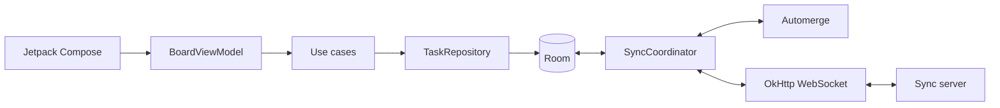

# StillWorx

StillWorx is a native Android, offline-first collaborative Kanban board. It has three columns (TODO, DOING, and DONE), local drag-and-drop, Room persistence, and CRDT synchronization through Automerge and WebSocket.

Room is always the mobile application's source of truth. Creating, editing, moving, and deleting cards never waits for the network.

Connection checks and reconnects are automatic. After the app returns from an offline period, incoming documents are staged so they cannot unexpectedly rearrange the visible board. The user chooses when to apply them with **Sync changes**.



See [Architecture](docs/ARCHITECTURE.md) for the component boundaries, Hilt object graph, local and remote update sequences, reconnect behavior, conflict semantics, persistence model, and prototype limitations.

## Configuration

The build-time keys are declared in `app/build.gradle.kts`:

- `SYNC_SERVER_URL`
- `SYNC_BOARD_ID`

For local development, put their values in the project-root `local.properties` file:

```properties
sdk.dir=C\:\\Users\\you\\AppData\\Local\\Android\\Sdk
SYNC_SERVER_URL=ws://<server-LAN-IP>:8080
SYNC_BOARD_ID=demo-board
```

For a physical phone, use the development machine's LAN IPv4 address, not `localhost`. The phone and computer must share Wi-Fi, the server must listen on `0.0.0.0:8080`, and the firewall must allow inbound TCP 8080. Use `ws://10.0.2.2:8080` for the Android emulator.

Host environment variables are also supported:

```powershell
$env:SYNC_SERVER_URL = "ws://<server-LAN-IP>:8080"
$env:SYNC_BOARD_ID = "demo-board"
.\gradlew.bat :app:assembleDebug
```

Precedence is `local.properties` -> host environment -> defaults (`ws://10.0.2.2:8080`, `demo-board`). Gradle compiles the selected values into `BuildConfig`; they are not runtime Android environment variables. Rebuild and reinstall after changing them.

## Build and test

```powershell
.\gradlew.bat --no-daemon :app:testDebugUnitTest :app:assembleDebug
.\gradlew.bat --no-daemon :app:connectedDebugAndroidTest
.\gradlew.bat --no-daemon :app:installDebug
```

The native Automerge runtime makes the Room, CRDT, synchronization, and Compose behavior tests instrumentation tests. Run `connectedDebugAndroidTest` on an emulator or physical device to execute them.

## UI behavior

- Long-press a card and drag it to another column. The board scrolls horizontally near its edges during a drag.
- A drag gesture is local and ephemeral. Other devices see the durable card move after it is dropped and synchronized.
- Remote inserts, moves, edits, and deletes animate through keyed Compose lazy-list transitions.
- Red means offline, amber means connecting, and green means connected.
- The offline banner confirms that changes remain saved locally. After three automatic retries fail, it offers a **Retry** CTA.
- After a successful reconnect, the banner offers **Sync changes** before staged remote updates are applied to Room and allowed to rearrange the board.
