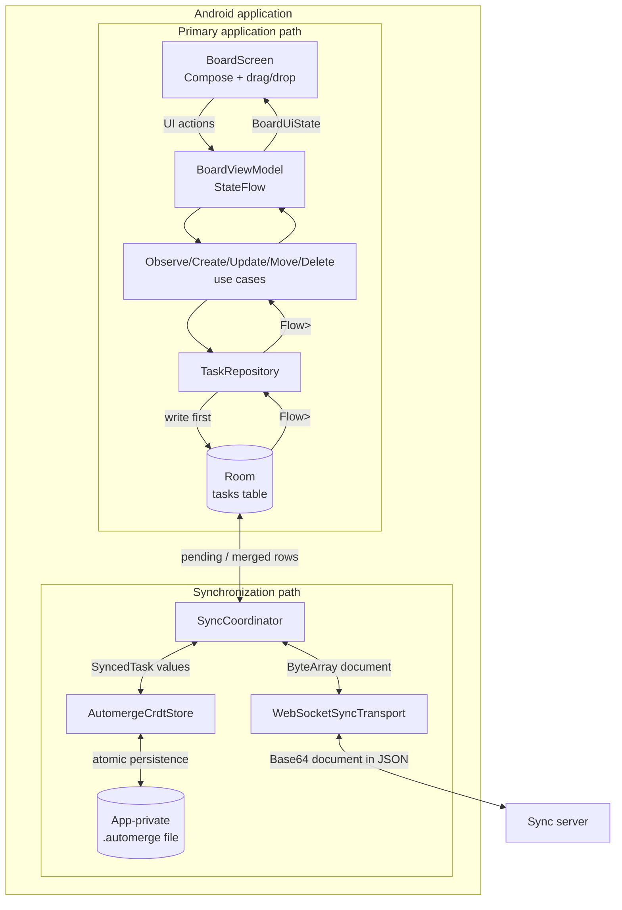
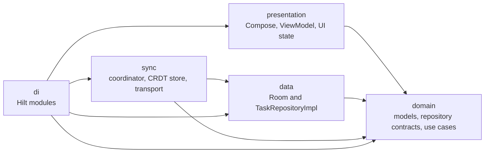
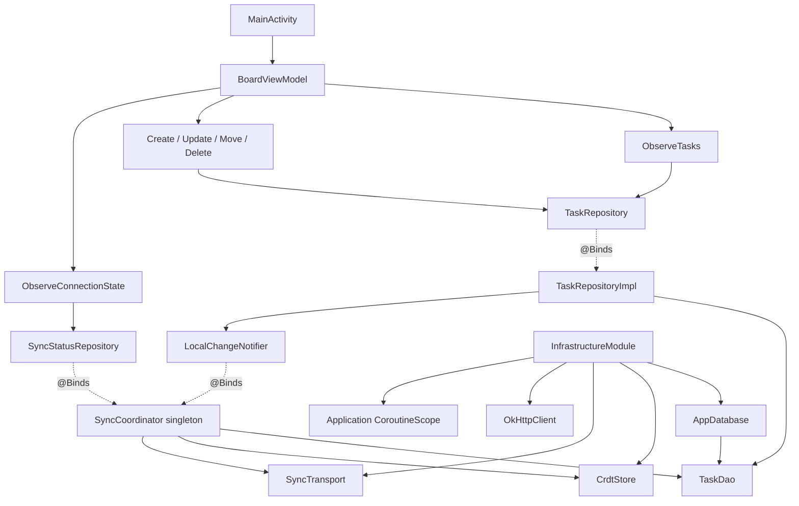
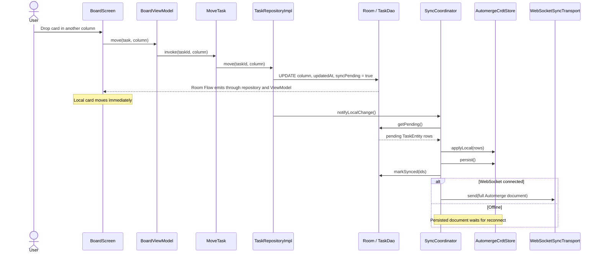
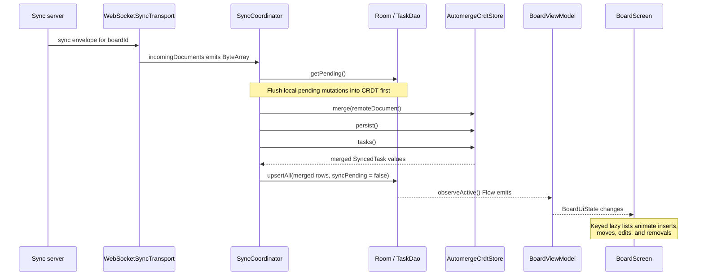
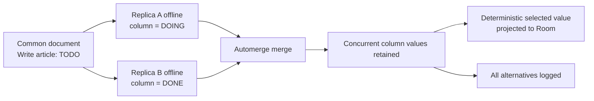

# StillWorx architecture

## Design goals

StillWorx is designed as a normal offline-first Android application whose synchronization implementation happens to use a CRDT. The important constraints are:

1. Room is the source of truth for everything displayed by the app.
2. Local operations complete without checking network availability.
3. Synchronization is a separate architectural path.
4. Automerge types never escape the `sync` package.
5. WebSocket transports documents; it does not define merge semantics.
6. Hilt constructs the object graph but does not replace the architectural boundaries.

## System overview

The primary application path and synchronization path meet at Room. Presentation code never reads from WebSocket or Automerge.



The connection state takes a narrow route into presentation through `SyncStatusRepository`. It is informational only and never gates a task operation.

## Package and dependency boundaries



| Package | Responsibility | Must not do |
|---|---|---|
| `presentation` | Render `BoardUiState`, collect lifecycle-aware flows, dispatch user actions, and animate Room-backed changes | Read WebSocket messages, merge CRDT state, or query Room directly |
| `domain` | Define `Task`, `TaskColumn`, repository contracts, and small use cases | Depend on Android persistence, transport, or Automerge APIs |
| `data` | Store/query tasks with Room and implement the normal task repository | Treat the network as the primary read path |
| `sync` | Reconcile Room, Automerge, persisted CRDT state, and WebSocket messages | Expose Automerge documents to presentation or domain |
| `di` | Assemble infrastructure and bind interfaces to implementations | Contain business or synchronization policy |

## Hilt object graph

`StillWorxApplication` is annotated with `@HiltAndroidApp`, `MainActivity` is an Android entry point, and `BoardViewModel` is a `@HiltViewModel`. Constructor injection is used where possible; providers are used for infrastructure that requires construction logic.



`SyncCoordinator` implements both `LocalChangeNotifier` and `SyncStatusRepository`. This lets the data layer notify sync after a successful local write while the UI observes connection and reconnect-approval state through domain use cases. The coordinator starts connection checks automatically.

## Local mutation flow

The same sequence runs online and offline. A drag is purely local UI state until the card is dropped; the drop calls `MoveTask`.



`syncPending` protects local Room mutations that have not yet been represented in the persisted Automerge document. It is cleared after CRDT application and persistence, not after network delivery. Network delivery can safely happen later because the current document remains on disk.

## Remote update flow

The UI has no special remote-update branch. An incoming document becomes a normal Room update, and the existing Room `Flow` drives recomposition.



The other device does not see a live drag shadow or pointer position. Those are ephemeral interaction details. It sees the resulting card position after drop, CRDT synchronization, merge, and Room emission.

## Startup and reconnect behavior

```mermaid
stateDiagram-v2
    [*] --> LoadLocal
    LoadLocal: Load/create persisted Automerge document
    LoadLocal --> Reconcile: Push syncPending Room rows
    Reconcile --> ApplyLocalCrdt: Project CRDT state into Room
    ApplyLocalCrdt --> Connecting: Automatic connection check
    Connecting --> Connected: WebSocket onOpen
    Connecting --> Disconnected: WebSocket failure
    Connected --> Disconnected: Connection lost
    Disconnected --> Connecting: Up to 3 automatic retries, 2 seconds apart
    Disconnected --> Connecting: User taps Retry after exhaustion
    Connecting --> AwaitApproval: Reconnected after offline
    AwaitApproval: Remote documents are staged; Room is unchanged
    AwaitApproval --> Connected: User taps Sync changes
    Connected --> Connected: send current document on connect
```



| State | UI | Application operations |
|---|---|---|
| `DISCONNECTED`, retrying | Red dot and local-storage explanation | Fully enabled |
| `DISCONNECTED`, retries exhausted | Red dot, local-storage explanation, and **Retry** CTA | Fully enabled |
| `CONNECTING` | Amber dot and automatic connection-check progress | Fully enabled |
| `CONNECTED`, approval required | Green dot, staged-update explanation, and **Sync changes** CTA | Fully enabled; visible board remains unchanged |
| `CONNECTED` | Green dot; banner smoothly collapses | Fully enabled |

`WebSocketSyncTransport` connects on startup and makes up to three automatic retries after failure. When those attempts are exhausted, it exposes manual-retry state and waits for the user. A failed manual attempt returns directly to that state instead of starting another automatic cycle. If a previously connected session reconnects, `SyncCoordinator` pauses Room projection and queues incoming full documents. Local mutations still update Room immediately and are folded into the persisted local Automerge document. `ApproveSync` sends a serialized coordinator event that merges all staged documents, persists the result, and then updates Room once. The existing Room `Flow` subsequently animates the accepted board changes. Until approval, the visible board is stable.

## Persistence models

### Room row

```text
TaskEntity
  id: String                 primary key, locally generated UUID
  title: String
  column: String             TODO | DOING | DONE
  updatedAt: Long
  isDeleted: Boolean         tombstone
  syncPending: Boolean       not yet persisted into local CRDT
```

`observeActive()` excludes tombstones, so deletion disappears from the UI immediately while the row remains available for synchronization.

### Automerge document

```text
ROOT
  tasks: Map<taskId, Map>
    id: String
    title: String
    column: String
    updatedAt: Timestamp
    deleted: Boolean
```

The document is stored at `filesDir/crdt/<boardId>.automerge`. Persistence writes a temporary file and atomically replaces the previous document.

### WebSocket envelope

```json
{
  "type": "sync",
  "boardId": "demo-board",
  "document": "<base64 Automerge document>"
}
```

The transport filters messages by `type` and `boardId`, decodes the document, and emits bytes. It does not inspect tasks or make conflict decisions.

## Concurrency and conflict semantics

Independent changes survive when replicas reconnect because each replica retains Automerge history and merges the other document.



The application deliberately does not implement timestamp/LWW conflict resolution. `AutomergeCrdtStore` calls `getAll` and logs fields with multiple concurrent values, then uses Automerge's deterministic selected value when projecting the document into Room. Replicas converge, but that selected value is not a business preference. Conflict-free convergence therefore does not guarantee business-semantic correctness.

## Compose UI behavior

- `BoardRoute` collects `BoardViewModel.uiState` with lifecycle awareness.
- `BoardScreen` is stateless with callbacks for application actions; only drag hover, scrolling, and other ephemeral rendering state are remembered locally.
- Cards use Android/Compose drag-and-drop transfer data containing the task ID.
- Column drop targets resolve the latest task value before invoking the move callback.
- Custom accessibility actions provide non-drag alternatives for moving cards.
- Keyed `LazyColumn` items animate remote and local inserts, removals, and placement changes.
- Card size changes use spring-based animation, preventing remote title edits from snapping the list layout.
- The connection badge animates both its content width and status color, preventing abrupt app-bar movement without leaving fixed trailing space.

## Configuration boundary

`app/build.gradle.kts` declares `SYNC_SERVER_URL` and `SYNC_BOARD_ID` as generated `BuildConfig` fields. Resolution order is:

1. Project-root `local.properties`
2. Host environment variable with the same name
3. Built-in emulator-oriented default

These are build-time values. Changing them requires rebuilding and reinstalling the APK. See the root [README](../README.md#configuration) for concrete examples.

## Test coverage

| Area | Test class | Covered behavior |
|---|---|---|
| Room | `TaskDaoTest` | Insert, update, move, tombstone, pending metadata, and active Flow filtering |
| CRDT | `AutomergeCrdtStoreTest` | Create/mutate, save/load, divergent replicas, independent changes, and concurrent moves |
| Room + sync | `SyncCoordinatorTest` | Incoming Automerge document merges and updates Room as source of truth |
| Compose | `BoardScreenTest` | Drag affordance, accessibility moves, persistent connection banner, connection transitions, and remote-style card movement |

Run the Android-backed suite with:

```powershell
.\gradlew.bat --no-daemon :app:connectedDebugAndroidTest
```

## Prototype limitations

- Full Automerge documents are transferred as Base64 JSON envelopes. Production synchronization should use incremental Automerge changes or sync messages.
- `syncPending` narrows the Room/CRDT process-failure window, but production consistency should use a durable transactional outbox spanning the local mutation and synchronization intent.
- Authentication and authorization are omitted.
- The server and transport protocol are intentionally minimal and assume compatible board-scoped broadcasting.
- Reliable background synchronization requires WorkManager or service/lifecycle design plus OS network and battery policy handling.
- Reconnect uses a fixed two-second delay rather than exponential backoff, jitter, and network policy.
- Connection status means the WebSocket is open; it is not a per-document synchronization acknowledgement.
- Live collaborative pointer/drag presence is not implemented. Only durable changes are synchronized.
- Tombstones are not compacted or garbage-collected.
- Conflict-free convergence does not imply that the selected result matches a product-level business rule.
