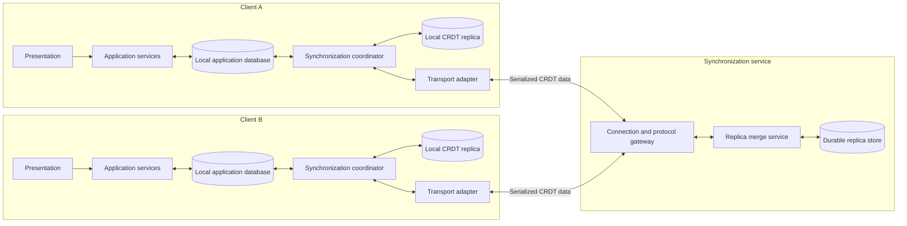
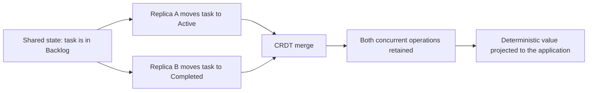
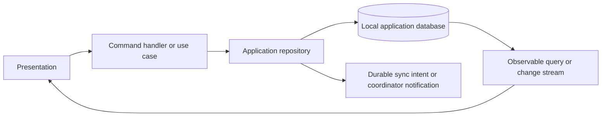
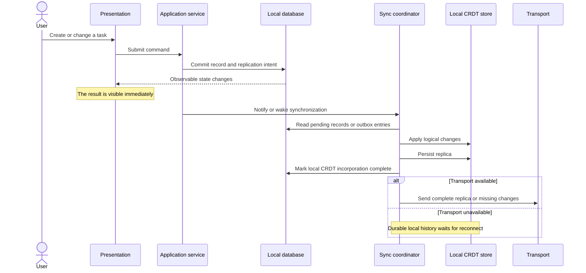
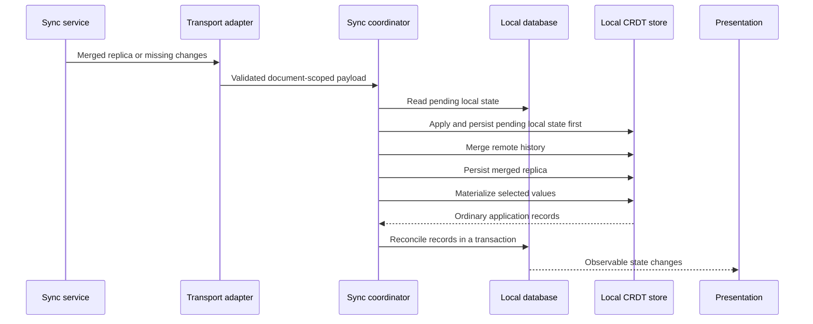

# Platform-agnostic offline-first CRDT system architecture

## 1. Purpose

This document defines a platform-neutral architecture for an offline-first collaborative task board. It applies to mobile, desktop, web, and embedded clients and does not require a particular programming language, UI toolkit, database, transport library, operating system, or server runtime.

The design uses a conflict-free replicated data type, or CRDT, to reconcile changes made independently on multiple clients. Automerge is used as the concrete CRDT model in examples, but the component boundaries also apply to another document CRDT with equivalent persistence, merge, and synchronization capabilities.

The central invariant is:

> A user action becomes local application state first, durable replicated history second, and shared history eventually.

Network availability never determines whether a local task operation can complete.

## 2. Design goals

1. Local create, edit, move, and delete operations complete without contacting a server.
2. The client application database is the source of truth for visible UI state.
3. Each client durably retains the CRDT history needed to synchronize after an indefinite offline period.
4. The synchronization server remains independent of the task schema and business rules.
5. Independently edited replicas converge after exchanging the same changes.
6. Transport, replication, application storage, and presentation remain separate architectural concerns.
7. Process restarts and interrupted writes do not silently discard acknowledged local work.
8. Multiple boards or documents are isolated in storage, processing, subscriptions, and access control.
9. The design can evolve from complete-document exchange to incremental CRDT synchronization without changing the application layer.

## 3. System context



The system has three persistent representations:

- each client has an application-oriented local database;
- each client has a durable CRDT replica; and
- the server has a durable merged CRDT replica for each shared document.

The representations overlap in logical content but have different jobs. The application database supports queries and rendering. The CRDT replicas retain causal history and make distributed merging possible.

## 4. Core concepts

### 4.1 Offline-first

An offline-first client treats local persistence as the primary operational dependency. A network connection is used to exchange history, not to authorize every local mutation.

A local operation therefore follows this order:

1. validate the command using locally available rules;
2. commit the application change locally;
3. update the visible UI from the local database;
4. durably incorporate the change into the local CRDT replica; and
5. transmit the replica or missing CRDT changes when connectivity permits.

This differs from a server-first application that waits for a remote CRUD response before committing the result locally.

### 4.2 Replica

A replica is an independently editable copy of a shared document together with the history required to merge it. A client can branch from a common state, remain offline, and later merge its history with other replicas.

The server is also a replica. It is a durable meeting point for client histories, but it is not necessarily the exclusive authority over the latest valid state. A disconnected client may hold valid changes the server has never seen.

### 4.3 CRDT

CRDT stands for **conflict-free replicated data type**. A CRDT assigns stable identity and causal information to changes. Its merge operation has convergence-friendly mathematical properties, commonly described as:

- **commutative:** merging A with B converges to the same result as merging B with A;
- **associative:** grouping a series of merges differently does not change the converged result; and
- **idempotent:** merging the same history again does not apply it twice.

These properties make duplicate delivery, reconnects, and differing arrival order manageable.

“Conflict-free” means replicas can converge without a central lock or a custom merge for every network race. It does not mean concurrent human intentions can never disagree. If two users independently assign different values to the same field, the CRDT can retain both operations and select a deterministic visible value, but a product-specific rule may still be required.

### 4.4 Automerge

Automerge is a document CRDT. Application data is represented through maps, lists, text, counters, and scalar values, while Automerge internally records operations and causal relationships.

The essential operations are:

| Operation | Purpose |
|---|---|
| Create | Start an empty replica |
| Change or transaction | Add local operations to the replica history |
| Save | Serialize a complete document and its history into bytes |
| Load | Reconstruct a document from serialized bytes |
| Merge | Combine the histories of two replicas |
| Heads or sync state | Describe known history and determine what is missing |
| Conflict inspection | Read concurrent values retained for a property |

A serialized Automerge document is not merely a snapshot of current JSON values. It also contains replication history. Two documents with the same visible tasks may still carry different histories that must be exchanged.

### 4.5 Causality and concurrency

Two changes are causally ordered when one replica had already observed the first change before creating the second. They are concurrent when neither was created with knowledge of the other.

For example:



Wall-clock timestamps are not a reliable substitute for causality. Device clocks can drift, be changed, or have different precision. A timestamp can remain useful application metadata without determining CRDT merge order.

### 4.6 Materialized view

The CRDT contains replicated history. The local application database contains a materialized view optimized for application behavior.

**Projection** converts the CRDT's current selected values into ordinary database records. Presentation code observes this database rather than CRDT objects. This keeps distributed-systems concerns out of the UI and domain layers.

### 4.7 Tombstones

A distributed delete must survive a merge with a replica that still contains an older task version. The logical data therefore records a deletion marker rather than immediately erasing all evidence of the object.

The application database filters tombstones from active queries. The CRDT retains the deletion state and its history. Tombstone cleanup requires a deliberate retention or compaction policy because premature removal can resurrect deleted data.

## 5. Logical architecture and boundaries

| Layer or component | Responsibility | Must not do |
|---|---|---|
| Presentation | Render application state and dispatch user intent | Read network messages or CRDT documents directly |
| Domain | Define entities, commands, policies, and repository contracts | Depend on a database engine, transport, or CRDT library |
| Application repository | Execute normal local operations and expose observable state | Wait for network availability before committing |
| Local database adapter | Persist application records, tombstones, and synchronization intent | Resolve cross-replica history |
| Sync coordinator | Serialize reconciliation and move state between database, CRDT, and transport | Render UI or implement server access control |
| CRDT store | Apply logical records, merge documents, inspect conflicts, save, load, and persist | Manage connection lifecycle |
| Transport adapter | Connect, frame messages, route document IDs, and report connection state | Interpret task fields or choose conflict winners |
| Protocol gateway | Validate envelopes, authenticate peers, and manage subscriptions | Implement task CRUD |
| Replica merge service | Load, merge, persist, and return document replicas | Interpret application schema unless explicitly required for validation |
| Durable replica store | Atomically retain server replicas | Manage presentation or client lifecycle |

The UI path and synchronization path meet only at the local application database.

## 6. Platform-neutral client architecture

### 6.1 Application path



The repository owns user-facing task operations. A create operation generates a globally unique task ID. An edit or move changes the corresponding fields. A delete writes a tombstone. Every operation also records that the changed logical state still needs to be incorporated into the local CRDT.

An observable query can be implemented with database change streams, reactive queries, event subscriptions, or a local state store. The architectural requirement is that the UI receives changes from the local application state, regardless of whether those changes originated locally or remotely.

### 6.2 Synchronization coordinator

The coordinator serializes these event types per document:

- local application state changed;
- transport connected or disconnected;
- remote CRDT data arrived;
- retry requested;
- synchronization approval requested; and
- application shutdown or background transition.

Serialization can use an actor, mailbox, event loop, serial executor, mutex-protected queue, or equivalent mechanism. The requirement is that two reconciliation operations for the same document cannot interleave and corrupt the dual-store invariants.

Different document IDs may be processed concurrently if their state, locks, and persistence paths are isolated.

### 6.3 CRDT adapter boundary

CRDT library types remain behind a small interface such as:

```text
CrdtStore
  load(documentId)
  applyLocal(records)
  merge(remoteBytes)
  materialize()
  serialize()
  persist()
  inspectConflicts()
  close()
```

The application and domain layers exchange ordinary records. This makes it possible to upgrade the CRDT library, change bindings, or replace complete-document transport with an incremental protocol without rewriting presentation logic.

## 7. Client storage model in detail

### 7.1 Application database

The local application database can be relational, document-oriented, key-value based, or an embedded object database. It must support atomic local updates and a way to observe changes.

A portable task record is:

```text
TaskRecord
  id: String
  documentId: String
  title: String
  status: String
  updatedAt: Timestamp
  deleted: Boolean
  replicationPending: Boolean
```

Recommended constraints and indexes include:

- a primary key on `(documentId, id)` or a globally unique `id`;
- an index supporting active tasks by `documentId` and `status`;
- an index on `replicationPending` for efficient recovery; and
- filtering `deleted = false` from normal user-facing queries.

`replicationPending` has a precise meaning: the current application record has not yet been durably represented in the local CRDT replica. It must not be interpreted as confirmation that the server or another client has received the change.

If product requirements need delivery status, store separate milestones such as:

```text
ReplicationStatus
  documentId
  localRevision
  localCrdtHead
  lastServerObservedHead
  lastPeerAcknowledgedHead
  lastError
```

The exact fields depend on whether the protocol provides acknowledgements and exposes CRDT heads.

### 7.2 Local CRDT persistence

Each shared document has one durable local CRDT replica. A generic storage key is:

```text
crdt/<documentId>.automerge
```

On platforms without a filesystem, the bytes may be stored as a binary value in an embedded database, browser storage, secure application storage, or another transactional local store. The requirement is durable, document-scoped binary storage with crash-safe replacement.

Conceptually, the document contains:

```text
ROOT
  schemaVersion: Integer
  tasks: Map<taskId, Map>
    id: String
    title: String
    status: String
    updatedAt: Timestamp
    deleted: Boolean
```

The schema version should be explicit in a production system. Schema migrations must preserve CRDT object identity and history where possible rather than exporting current values and creating unrelated objects.

### 7.3 Crash-safe local persistence

A filesystem implementation should:

1. serialize the in-memory CRDT document;
2. write the bytes to a temporary file in the same storage volume;
3. flush according to the required durability level;
4. atomically replace the destination; and
5. retain or validate the prior version if the platform cannot guarantee atomic replacement.

A transactional database implementation should update the binary value in one transaction. Browser clients must account for storage quotas, eviction policies, private browsing, and multi-tab coordination.

Persist the CRDT before clearing `replicationPending`. If the process stops after the application database commit but before CRDT persistence, the pending marker enables recovery. If it stops after CRDT persistence but before clearing the marker, replaying the same logical value is safe when the CRDT adapter avoids unnecessary duplicate writes or uses idempotent operation identity.

### 7.4 Durable outbox option

The pending flag is a minimal recovery mechanism. A stronger design uses a transactional outbox stored with the application mutation:

```text
ReplicationOutboxEntry
  operationId: Unique identifier
  documentId: String
  entityId: String
  operationType: CREATE | UPDATE | MOVE | DELETE
  payload: Versioned logical data
  createdAt: Timestamp
  appliedToCrdtAt: Optional timestamp
```

The coordinator applies unapplied entries to the local CRDT, persists it, then marks the entries complete. This preserves individual mutation intent and makes recovery and observability clearer. Completed entries can be compacted after their CRDT heads are durably known.

### 7.5 In-memory client state

The following state is normally ephemeral:

- loaded CRDT objects;
- connection handles;
- retry timers;
- per-document synchronization queues;
- incremental sync session state that can be recreated;
- remote documents staged for optional user approval; and
- transient UI interaction state.

If any of this state is required to survive process termination, it must be promoted to durable storage. For example, approval-staged remote data should be persisted if the product promises that an approval prompt survives a restart unchanged.

### 7.6 Why the client uses two stores

| Capability | Application database | CRDT replica |
|---|---:|---:|
| Local queries and filtering | Primary responsibility | Not exposed to application code |
| Reactive UI updates | Primary responsibility | Indirect through projection |
| Immediate offline writes | Primary responsibility | Updated asynchronously or in a coordinated step |
| Causal replication history | No | Primary responsibility |
| Divergent replica merge | No | Primary responsibility |
| Restart recovery | Application values | Replication values and history |

The two stores should not be collapsed merely to avoid synchronization code. Querying the CRDT directly from presentation couples the application to distributed merge representation. Treating the application database alone as replication history loses causal information.

## 8. Server architecture

### 8.1 Protocol gateway

The gateway owns:

- connection establishment and termination;
- authentication and authorization;
- message-size enforcement;
- envelope parsing and validation;
- mapping connections to document subscriptions;
- routing data by document ID;
- backpressure and slow-consumer policy; and
- broadcasting merged results or incremental responses.

It treats the serialized CRDT payload as opaque binary data after validating that the CRDT engine can load it.

### 8.2 Replica merge service

The merge service performs, per document:

1. validate the document identifier;
2. load the incoming CRDT data;
3. load the current server replica from cache or durable storage;
4. initialize from the incoming replica when no server replica exists;
5. otherwise merge incoming and current histories;
6. serialize the merged replica;
7. durably persist it;
8. update the in-memory cache; and
9. return the persisted result to the gateway.

The service must not broadcast a merge result before durable persistence succeeds.

### 8.3 Durable server replica store

The storage implementation may use:

- one binary file or object per document;
- a database binary column keyed by document ID;
- object storage with conditional version replacement;
- a replicated key-value store; or
- a CRDT-aware persistence service.

A generic record is:

```text
ServerReplica
  documentId: String
  serializedDocument: Binary
  storageVersion: Monotonic token
  byteLength: Integer
  updatedAt: Server timestamp
  checksum: Optional digest
  schemaVersion: Optional extracted metadata
```

`storageVersion` or an equivalent compare-and-swap mechanism is important when multiple server instances can update the same document. An in-process mutex is insufficient in a horizontally scaled deployment.

### 8.4 Server cache

The merge service may lazily load document replicas and retain them in memory. The cache should have:

- a bounded size or eviction policy;
- per-document synchronization;
- invalidation or version checks across server instances;
- corruption handling for failed CRDT loads; and
- metrics for hit rate, document size, and load latency.

The durable store, not the cache, defines restart recovery.

### 8.5 Per-document ordering

The service must serialize the complete merge transaction for each document:

```text
receive
  -> load current replica
  -> merge
  -> serialize
  -> persist
  -> publish
```

Operations for different document IDs may execute concurrently. In one process, a keyed queue or mutex is sufficient. Across several processes, use storage transactions, compare-and-swap retries, a distributed lock with fencing tokens, or consistent routing that gives one active owner responsibility for a document.

### 8.6 Server storage is not a task database

The synchronization service does not need task-level CRUD tables. It stores mergeable document histories. Application-specific APIs, reporting, search, analytics, and administrative tools should consume a separate projection if needed rather than teaching the core relay to mutate CRDT internals inconsistently.

## 9. End-to-end data flows

### 9.1 Local mutation



### 9.2 Server processing

```mermaid
flowchart LR
    RECEIVE["Receive framed message"] --> AUTH["Authenticate and authorize"]
    AUTH --> VALIDATE["Validate envelope and limits"]
    VALIDATE --> DECODE["Decode CRDT payload"]
    DECODE --> QUEUE["Enter document-scoped queue"]
    QUEUE --> LOAD["Load incoming and current replicas"]
    LOAD --> MERGE["Merge histories"]
    MERGE --> SAVE["Serialize result"]
    SAVE --> PERSIST["Durably persist"]
    PERSIST --> PUBLISH["Publish to authorized subscribers"]
```



Failures before persistence do not publish a new state. Failures after persistence but during publication are recovered by reconnect and idempotent CRDT exchange.

### 9.3 Receiving remote state



The client merges incoming data with its latest local replica. It never blindly replaces the local replica, because a new local edit may have occurred while an earlier message was in flight.

### 9.4 Startup and recovery

At startup, for each active document:

1. open the local application database;
2. load or initialize the local CRDT replica;
3. recover pending records or outbox entries into the CRDT;
4. persist the recovered CRDT;
5. clear only the successfully incorporated pending state;
6. materialize the CRDT and reconcile it into the local database;
7. start the transport; and
8. send the current document or initialize an incremental sync session.

If the local CRDT cannot be loaded, do not silently overwrite it with an empty document. Quarantine the damaged value, report the failure, attempt recovery from a verified prior version or server replica, and preserve pending application mutations.

### 9.5 Reconnection

After a connection is re-established:

1. authenticate again if required;
2. identify each document the client may synchronize;
3. send the latest complete replica or resume incremental sync state;
4. keep accepting local writes during reconciliation;
5. merge incoming history with the current local replica;
6. persist before projection; and
7. continue exchanging changes until the peer sync states indicate convergence.

Use bounded exponential backoff with jitter. Retry behavior should respect application lifecycle, network reachability, battery policy, server retry hints, and user-initiated retry.

### 9.6 Optional approval gate

Some products should not rearrange visible content immediately after a long offline period. An optional approval policy can stage remote history after reconnection:

- local application writes continue normally;
- incoming CRDT data is retained without projecting it to the application database;
- the UI indicates that remote changes are ready;
- user approval merges all staged history, persists it, and performs one database projection; and
- the resulting replica is sent again if it contains history the server lacks.

This gate is a user-experience policy. It does not change CRDT correctness. If staged data must survive process termination, it must be persisted.

## 10. Reconciliation into the application database

Projection should run in one local database transaction per document snapshot or bounded change batch.

A safe snapshot projection is:

1. materialize all CRDT task objects;
2. validate required identifiers and supported enum values;
3. map CRDT deletion flags to local tombstones;
4. upsert all materialized records with `replicationPending = false` for remote-derived values;
5. preserve newer local pending records that were not yet incorporated into the CRDT; and
6. commit once, causing observers to see a coherent state.

For large documents, an incremental projection should derive changed entity IDs from CRDT changes rather than rewriting every record. It must still preserve transaction boundaries and deletion semantics.

Malformed application values inside an otherwise valid CRDT document require an explicit policy. Options include quarantining the affected entity, retaining the previous local projection, recording a validation error, or rejecting synchronization. Silently dropping invalid fields can cause replicas and application views to disagree.

## 11. Conflict behavior

### 11.1 Independent changes

Changes to separate tasks or separate fields normally survive together. A title edit on one replica and a status move on another can both appear after merge if they are represented as independent CRDT properties.

### 11.2 Same-field concurrent changes

When two replicas concurrently write the same property, the CRDT retains the operations and exposes a deterministic selected value. The adapter should also inspect and record concurrent alternatives where the library supports it.

Possible product policies include:

- accept the CRDT-selected value silently for low-risk fields;
- show a conflict indicator with both alternatives;
- apply a deterministic domain rule after merge;
- require explicit user resolution; or
- model the domain differently so both intents can coexist.

A post-merge business rule must itself create a new CRDT change if its decision needs to replicate. Merely changing the local database projection would cause the view to diverge from the replicated document.

### 11.3 Deletion conflicts

Concurrent edit-versus-delete behavior must be specified. The CRDT can preserve both operations, but the product must decide whether deletion hides the edited task, whether restoration is available, and how a restored record gets a new causally later deletion flag.

### 11.4 Side effects

Do not attach non-idempotent external effects directly to CRDT message receipt. Repeated delivery and replay are normal. If a converged state should trigger an email, payment, or workflow action, use a separate idempotent process keyed by stable operation or domain event identifiers.

## 12. Transport protocol

The architecture supports WebSocket, bidirectional streaming RPC, peer-to-peer channels, message queues, or periodic request and response. The protocol must provide:

- a versioned envelope;
- document routing;
- authentication context;
- payload encoding and limits;
- explicit error responses;
- duplicate-safe delivery;
- reconnect behavior; and
- either complete-document exchange or incremental CRDT sync messages.

A platform-neutral envelope is:

```json
{
  "protocolVersion": 1,
  "type": "sync",
  "documentId": "board-123",
  "encoding": "base64",
  "payload": "<serialized CRDT data>"
}
```

Binary-capable transports should carry binary payloads directly and avoid Base64 overhead. A production incremental Automerge protocol should maintain peer sync state and exchange only missing changes.

### Delivery semantics to define

Every implementation must document:

- whether publication includes the sender;
- whether a response means received, merged, or durably persisted;
- whether messages can be duplicated or reordered;
- how clients detect that the server is missing local heads;
- how payload size and backpressure are handled;
- how subscriptions are established and revoked; and
- whether one connection may synchronize multiple documents.

Connection-open state alone must not be presented as proof that every local change is synchronized.

## 13. Source of truth and durability milestones

“Source of truth” depends on the question:

| Question | Authoritative representation |
|---|---|
| What should this client display now? | Client application database |
| What local application work survived restart? | Application database and durable sync intent |
| What local history can merge with peers? | Client CRDT replica |
| What shared history survived server restart? | Server durable replica store |
| What globally valid history might not yet be on the server? | Any offline client replica |

A local change passes through distinct durability milestones:

1. **Local commit:** visible application state and sync intent are durable.
2. **Local replica commit:** CRDT history is durable on the client.
3. **Transport acceptance:** the local transport accepted the outbound message.
4. **Server receipt:** the gateway received and validated the message.
5. **Server replica commit:** the merge result is durable on the server.
6. **Peer receipt:** another client received the relevant history.
7. **Peer projection:** another client persisted the merge and committed it to its application database.

Only expose a “synced” indicator after defining which milestone it represents.

## 14. Document and tenant isolation

The document identifier participates in:

- local application partitioning;
- local CRDT storage keys;
- server storage keys;
- queue and lock keys;
- cache keys;
- subscription routing;
- access-control checks; and
- logs and metrics.

Validate the identifier before using it as any storage path or key. Treat authorization as a separate check. Possession or knowledge of an identifier is not proof of access.

In a multi-tenant service, use an internal composite key such as `(tenantId, documentId)` and derive storage paths without concatenating untrusted input directly.

## 15. Security requirements

A production deployment should include:

- encrypted transport;
- authenticated clients and expiring sessions;
- authorization for every document subscription and update;
- protection against document ID enumeration;
- message-size, rate, connection, and storage quotas;
- validation that payloads are loadable CRDT data;
- dependency and native-library patching;
- secure local storage appropriate to the data sensitivity;
- audit events for access and administrative operations; and
- abuse controls for expensive merges and history amplification.

End-to-end encryption requires additional design because a server that cannot decrypt application content may still merge opaque Automerge changes, but metadata, key distribution, membership changes, revocation, and encrypted snapshot recovery must be handled explicitly.

## 16. Observability and operations

Recommended metrics include:

- active connections and document subscriptions;
- reconnect attempts and time to reconnect;
- inbound and outbound payload sizes;
- CRDT document and history growth;
- load, merge, serialization, persistence, and projection latency;
- per-document queue depth and wait time;
- local pending or outbox age;
- validation, authorization, merge, and storage failures;
- cache hit and eviction rates; and
- conflict counts by field category without logging sensitive values.

Use structured correlation fields such as request ID, connection ID, tenant ID, document ID, replica ID, and CRDT heads. Avoid logging serialized documents or user content by default.

Back up the durable server replica store and regularly test restoration. Where clients can be permanently lost, server backups may be the only remaining copy of parts of the shared history.

## 17. Testing strategy

### Client tests

- application mutations commit while the transport is unavailable;
- observable UI state comes only from the local database;
- pending records recover after interruption;
- CRDT save and load preserve history;
- incoming history merges with newer local edits rather than replacing them;
- projection is transactional and handles tombstones;
- duplicate messages are safe;
- staged approval behavior preserves visible state; and
- document routing never crosses identifiers.

### CRDT convergence tests

- independent edits on separate entities survive;
- independent fields on one entity survive;
- same-field concurrent changes converge deterministically;
- edit-versus-delete follows the documented policy;
- merge order does not alter the converged result;
- repeated merge is idempotent; and
- replicas converge after multiple offline branches.

### Server tests

- invalid envelopes and invalid CRDT bytes are rejected;
- unauthorized document access is rejected;
- a merge is persisted before publication;
- same-document requests are serialized;
- different documents can progress concurrently;
- restart lazily reloads durable replicas;
- storage failure prevents publication;
- slow consumers cannot exhaust service resources; and
- concurrent server instances cannot overwrite newer replicas.

### Failure-injection tests

Terminate processes between every dual-store and persist-and-publish step. Simulate truncated files, quota exhaustion, duplicate delivery, delayed messages, clock drift, reconnect storms, network partitions, and storage latency. Verify that acknowledged local changes remain recoverable and replicas ultimately converge.

## 18. Evolution path

### Prototype stage

- one server instance;
- complete serialized documents;
- one durable object per document;
- in-process per-document queues;
- pending flags for client recovery; and
- basic connection status.

### Production hardening

- authentication and document authorization;
- encrypted transport;
- incremental Automerge sync messages;
- durable client outbox;
- exponential reconnect backoff with jitter;
- schema versioning and migrations;
- metrics, tracing, backup, and corruption recovery;
- bounded caches and resource quotas; and
- explicit conflict and deletion policies.

### Scale-out stage

- partition documents across workers;
- use durable compare-and-swap storage or fenced ownership;
- route a document consistently to its active owner;
- distribute subscription events through a broker;
- snapshot and compact history according to verified CRDT procedures; and
- maintain projections for search, analytics, and administrative reporting without making them the merge authority.

## 19. Summary

This architecture separates four concerns:

1. the application database provides responsive, queryable local state;
2. the client CRDT replica retains mergeable local history;
3. the transport exchanges complete or incremental CRDT data; and
4. the server durably merges and redistributes document histories without owning application CRUD.

Local availability comes from committing to client storage first. Distributed convergence comes from durable CRDT replicas and idempotent history exchange. Maintainability comes from projecting CRDT state into a conventional application model and keeping CRDT and transport types behind dedicated interfaces.
