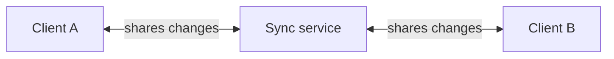
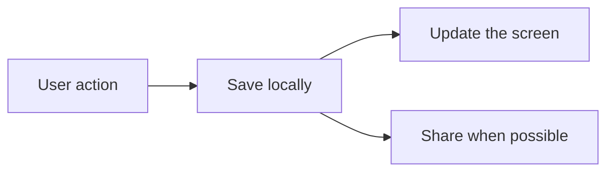
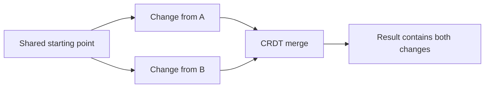
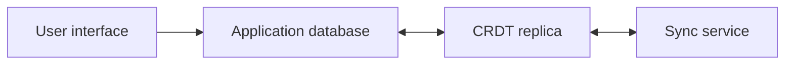
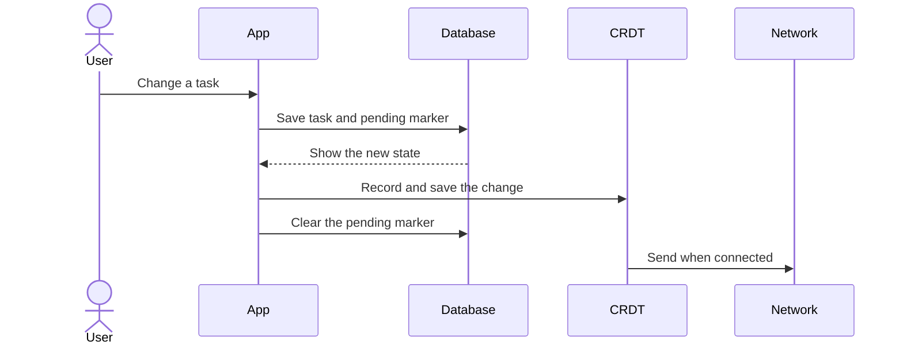
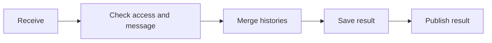
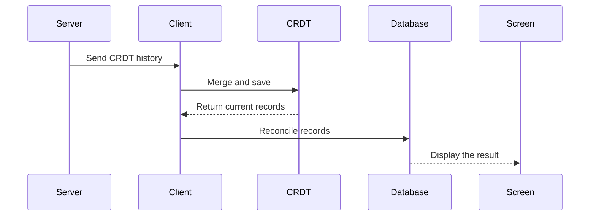
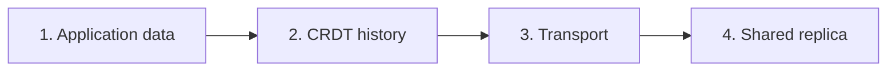

# Offline-first CRDT systems explained from scratch

## 1. The problem

Imagine a shared task board used on phones, computers, and web browsers.

Users want to make changes when they have no internet connection. Several people might also change the board at the same time. When they reconnect, the system must combine their work without losing valid changes.

This creates three requirements:

1. A local change must work immediately.
2. A local change must survive a restart.
3. Different copies of the board must be able to merge later.

An offline-first CRDT architecture is one way to meet these requirements.

## 2. The system in one picture



A **client** can be a mobile app, desktop app, web app, or another program.

The **sync service** is a place where clients exchange their change histories. It does not need to be the main application backend.

## 3. Offline-first

Offline-first means a client saves changes locally before trying to send them anywhere.



If the network is unavailable, the first two steps still work. Synchronization waits until later.

This is different from a server-first design:

```text
Server-first:
user action -> ask server -> wait -> save or display result

Offline-first:
user action -> save locally -> display result -> contact server later
```

## 4. A replica

A **replica** is one independently editable copy of shared data and its history.

If three devices use the same board, there can be four replicas:

- one on device A;
- one on device B;
- one on device C; and
- one on the synchronization server.

Each replica can temporarily know something the others do not. Synchronization allows them to exchange and merge that knowledge.

## 5. A CRDT

CRDT stands for **conflict-free replicated data type**.

A CRDT is designed so that replicas can:

- change independently;
- exchange changes in different orders;
- receive a change more than once; and
- still converge on the same result.

To **converge** means that replicas eventually agree after they have received the same history.

### A simple example

Both clients start with the same two tasks. They go offline.

```text
Client A renames task 1.
Client B moves task 2.
```

These changes do not interfere with each other, so both can survive the merge.



### What “conflict-free” does not mean

Two people can still express conflicting intentions. For example, both can move the same task to different places.

The CRDT makes every replica select the same result. It cannot know which human intention is better. The product may still need a business rule or a conflict-resolution screen.

## 6. Automerge

Automerge is one library that implements a document CRDT.

It stores normal-looking data such as maps, lists, text, and values. Behind those values, it retains the history required to merge replicas.

Automerge mainly does this:

```text
change -> save -> exchange -> load -> merge
```

Its serialized data contains more than the current visible values. It also contains change history. A client should therefore keep its replica instead of repeatedly rebuilding a new document from current database rows.

The architecture can use another CRDT library if it provides similar change, save, load, merge, and synchronization features.

## 7. Why a client often stores data twice

A client normally has:

1. an **application database**; and
2. a **CRDT replica**.



### Application database

The application database is designed for the product:

- find active tasks;
- group tasks by status;
- hide deleted tasks;
- update the screen when data changes; and
- validate normal application operations.

It can be relational, document-based, key-value based, or another local storage technology.

### CRDT replica

The CRDT replica is designed for synchronization:

- keep causal history;
- merge offline branches;
- tolerate duplicate delivery; and
- converge with other replicas.

The user interface should normally not query the CRDT directly.

### The simple rule

> The application database is for using the product. The CRDT replica is for merging copies of the product's data.

## 8. What the client stores

A simple task record in the application database could be:

```text
TaskRecord
  id
  documentId
  title
  status
  updatedAt
  deleted
  replicationPending
```

`replicationPending` means the current record still needs to be safely copied into the local CRDT replica.

It does not mean the server has not received it. Server delivery is a later step and should use separate status if the product needs to display it.

The CRDT replica could contain:

```text
Document
  schemaVersion
  tasks
    task ID
      title
      status
      updatedAt
      deleted
```

The actual stored CRDT data is normally binary and also contains history that is not shown above.

## 9. What happens after a local change



The exact code can run in one thread, a queue, an actor, a worker, or another mechanism. The important requirement is that operations for the same document do not overlap in a way that corrupts stored state.

## 10. Recovering from a crash

There is a small gap between saving the application database and saving the CRDT replica.

The pending marker closes most of this gap:

```text
database saved, CRDT not saved
  -> pending remains true
  -> startup finds it
  -> startup writes it into the CRDT
```

If the CRDT was saved but the pending marker was not cleared, the client may process the record again. The CRDT adapter should make this safe and avoid creating unnecessary duplicate changes.

A stronger design uses a **transactional outbox**. An outbox is a local table of synchronization work saved in the same transaction as the application change. A background coordinator processes those entries and marks them complete.

## 11. What the server stores

The server stores one CRDT replica per shared document.

A storage record can be as simple as:

```text
documentId -> serialized CRDT bytes
```

It may be stored in:

- a file;
- a database binary column;
- object storage;
- a key-value store; or
- another durable storage service.

The storage technology does not change the main rule:

> Save the merged replica before telling clients that the merge is available.

The server may cache loaded documents in memory for speed. The durable store, not the cache, is what survives a restart.

## 12. What the server does



The full flow is:

1. Receive CRDT data for a document.
2. Check identity, permission, document ID, message format, and size.
3. Load the incoming CRDT data.
4. Load the server's current replica.
5. Merge the two histories.
6. Save the result durably.
7. Send the result or missing changes to authorized clients.

The server does not need task-level create, update, or delete operations. It can treat the CRDT contents as opaque data.

## 13. Receiving remote changes



The client must merge remote history into its latest local replica. It must not simply replace the local replica. A user may have made a new local change while an older network message was travelling.

The database reconciliation should be one transaction so the screen does not observe a half-updated board.

## 14. Startup

A safe startup order is:

1. Open the application database.
2. Load the local CRDT replica.
3. Find pending changes or unfinished outbox entries.
4. Apply them to the CRDT and save it.
5. Update the pending state.
6. Project CRDT values into the application database.
7. Connect to the sync service.
8. Exchange the latest history.

If the CRDT file is damaged, do not silently replace it with an empty one. Preserve it for recovery, report the problem, and attempt to recover from a known valid local or server copy.

## 15. Reconnection

When reconnecting, the client sends its latest history or starts an incremental sync session.

The server might already have changes from other clients. The result is merged in both directions until the client and server know the same history.

Retry delays should gradually increase and include a small random amount. This is called **exponential backoff with jitter**. It prevents thousands of clients from reconnecting at exactly the same time.

Local changes remain enabled while reconnecting.

## 16. An optional approval step

Some products may not want remote changes to rearrange a screen immediately after a user returns online.

They can add an approval step:

```text
receive remote history
  -> stage it
  -> show "changes available"
  -> user approves
  -> merge and save
  -> update application database
```

This is a product choice, not a CRDT requirement.

If staged changes must survive an app restart, they need durable storage. In-memory staging is lost when the process ends.

## 17. Deletion and tombstones

Removing a database row is not enough in a distributed system. An old offline replica might later send the old task again.

Instead, record:

```text
deleted = true
```

This deletion marker is called a **tombstone**.

The application hides tombstones. The CRDT shares them with other replicas. Safely removing old tombstones requires a retention policy that understands which replicas could still return.

## 18. Conflicts

### Changes that do not compete

If one client edits task A and another edits task B, both changes normally survive.

If one client changes a title and another changes the status of the same task, both can normally survive because they affect separate fields.

### Changes that compete

If two clients change the same field without seeing each other's work, the values are concurrent.

The CRDT makes replicas converge, but the product must decide whether to:

- silently accept the CRDT-selected value;
- show that alternatives existed;
- apply a business rule; or
- ask a user to choose.

If a business rule chooses a new result, that result must be written back as a new CRDT change. Changing only the application database would make it disagree with replicated state.

## 19. Complete documents and incremental sync

The simplest protocol sends the complete serialized CRDT document whenever synchronization happens.

Advantages:

- simple to build;
- simple to debug; and
- the receiver gets all available history.

Disadvantages:

- messages grow as history grows;
- repeated data is sent; and
- large documents use more memory and bandwidth.

A production system should usually use the CRDT library's incremental sync protocol. Each peer tracks what the other peer knows and sends only missing changes.

The application layer should not care which approach is used. That choice belongs behind the sync coordinator and transport interfaces.

## 20. What “synced” can mean

A change passes through several stages:

1. Saved in the local application database.
2. Saved in the local CRDT replica.
3. Accepted by the local network library.
4. Received by the server.
5. Merged and saved by the server.
6. Received by another client.
7. Saved and displayed by that client.

A green connection icon proves only that a connection is open. It does not automatically prove that all seven stages are complete.

Before showing “synced,” decide exactly which stage the word represents.

## 21. Document isolation and security

Every shared document needs an identifier. That identifier is used for:

- local storage;
- server storage;
- routing;
- queues;
- cache entries;
- subscriptions; and
- permission checks.

Validate it before using it as a storage key or filename.

Knowing a document ID is not proof that a user may access it. A production system needs:

- encrypted connections;
- authenticated users or devices;
- permission checks for every document;
- message and storage limits;
- protection against abusive merge work;
- backups and recovery; and
- safe dependency updates.

## 22. A practical mental model

Think of the architecture as four boxes:



1. **Application data** makes the product work locally.
2. **CRDT history** makes independent copies mergeable.
3. **Transport** moves history but does not decide its meaning.
4. **Shared replica** gives clients a durable place to exchange history.

## 23. The shortest useful summary

```text
User changes something
  -> save it locally
  -> display it immediately
  -> record it in local CRDT history
  -> save that history
  -> share it when connected
  -> server merges and saves histories
  -> other clients merge the result
  -> other clients update their local databases
```

If you remember only four ideas, remember these:

1. Offline-first means local work does not wait for the network.
2. A replica is one editable copy of shared data and its history.
3. A CRDT lets replicas merge and converge.
4. The application database and CRDT replica solve different problems.
