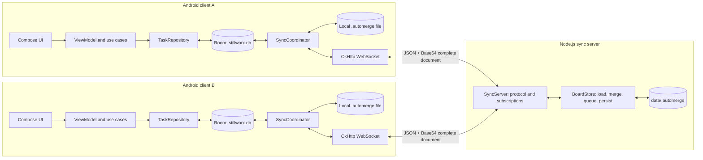
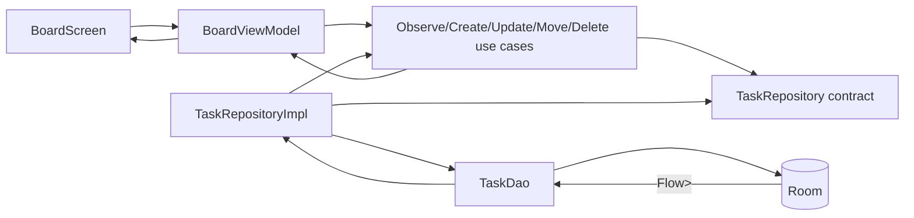
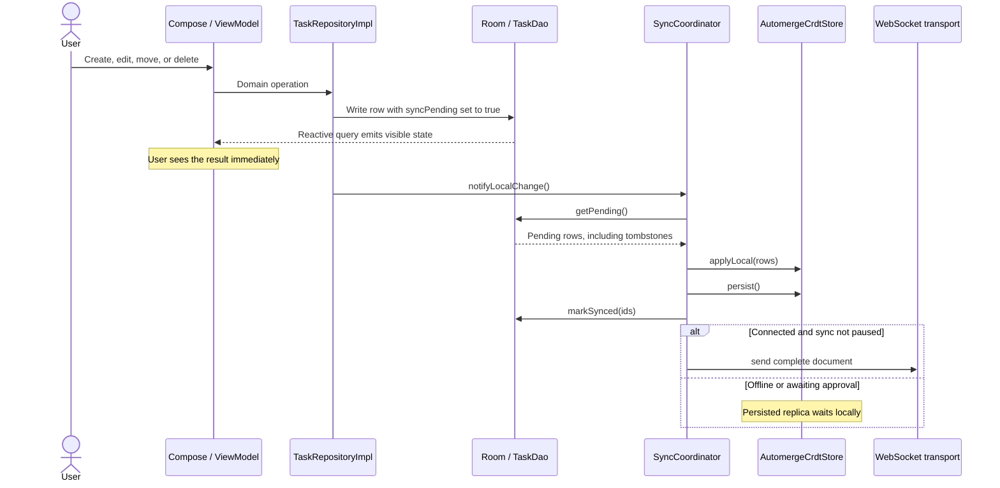
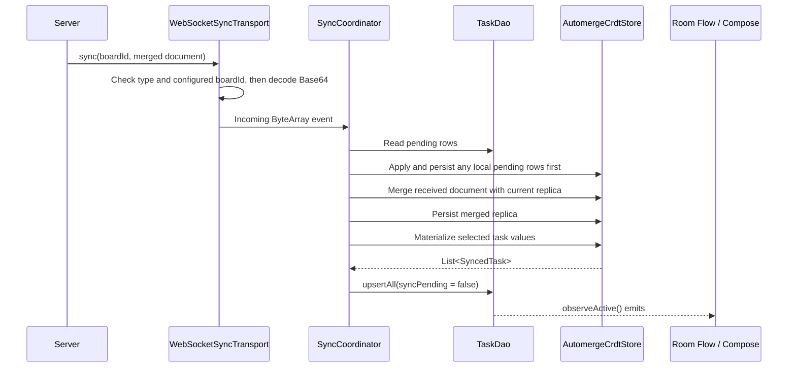

# StillWorx system architecture

## 1. Purpose and scope

StillWorx is an offline-first collaborative Kanban system. The current product consists of:

- a native Android client built with Kotlin, Jetpack Compose, Room, Hilt, Coroutines, OkHttp WebSocket, and Automerge;
- a Node.js/TypeScript synchronization server built with `ws` and Automerge; and
- a small WebSocket protocol that carries complete serialized Automerge documents as Base64-encoded JSON.

The system is intentionally designed so that the mobile app remains useful without the server. Creating, editing, moving, and deleting cards completes against local storage first. Synchronization is a separate path that reconciles independently edited replicas when connectivity is available.

This document describes the client and server as one system, explains the CRDT and Automerge concepts behind it, and details how data is represented, persisted, transmitted, merged, and projected back into the user interface.

## 2. Architectural principles

1. **Room is the Android application's source of truth.** All durable UI state is read from Room. Compose, ViewModels, and use cases never render directly from WebSocket messages or Automerge objects.
2. **Local writes do not depend on network availability.** The application writes to Room before notifying the synchronization path.
3. **Automerge owns replicated merge semantics.** Neither the WebSocket layer nor the server invents application-level last-write-wins rules.
4. **Every participating process keeps a replica.** Each Android client persists a local Automerge document, and the server persists a merged Automerge document for each board.
5. **Transport is schema-blind.** The server validates envelopes and Automerge bytes, but it does not interpret tasks, columns, timestamps, or deletion rules.
6. **Board histories are isolated by `boardId`.** Storage, processing queues, subscriptions, and broadcasts are board-scoped.
7. **Durable state is persisted before publication.** A client persists local CRDT changes before clearing `syncPending`; the server persists a merged document before broadcasting it.
8. **Connectivity is informational, not a write gate.** Disconnected, connecting, and approval-required states do not disable task operations.

## 3. System overview



There are two distinct data paths on a client:

- The **application path** runs from UI to use case to repository to Room, then back to the UI through a Room `Flow`.
- The **synchronization path** runs between Room, `SyncCoordinator`, the local Automerge file, WebSocket, and the server.

These paths meet at Room. A remote update is not displayed directly; it is first merged into Automerge, persisted, converted into Room rows, and then observed through the same application path as a local update.

## 4. Core concepts

### 4.1 Offline-first

Offline-first means the client treats its local database as the primary operational data source rather than as a disposable network cache. A user action succeeds locally even when the server is unreachable. Network synchronization is eventual: it propagates durable local history when a connection exists.

This differs from a conventional API-first application, where the client sends a CRUD request and often waits for the server response before committing or displaying the result.

### 4.2 Replica

A replica is one independently editable copy of a shared data structure and its change history. In StillWorx:

- every Android installation has a local Automerge replica for the configured board; and
- the server has a merged replica for every board it has received.

Replicas do not need to stay continuously connected. They can branch from a common state, accumulate changes independently, and later merge.

### 4.3 CRDT

CRDT means **conflict-free replicated data type**. A CRDT records changes with enough causal identity and history for independently edited replicas to be merged deterministically. The key property is convergence: if replicas eventually receive the same set of changes, repeated merges lead them to equivalent state regardless of message duplication or merge order.

The term “conflict-free” does not mean concurrent intent can never disagree. For example, two offline users can move the same task to different columns. Automerge preserves and deterministically resolves the concurrent values so replicas converge, but the selected value is not necessarily the business outcome a human would prefer.

CRDT merge should therefore be understood as:

- safe convergence of replicated history;
- preservation of independent edits where possible;
- idempotence when the same history is merged repeatedly; and
- deterministic handling of concurrent values.

It is not automatically:

- validation of business rules;
- authorization;
- an audit UI;
- a guarantee that wall-clock timestamps are trustworthy; or
- a replacement for product-specific conflict resolution.

### 4.4 Automerge

Automerge is the CRDT library used by the Android client and Node.js server. It exposes a document that contains application-shaped maps and values while internally retaining the operation history and causal relationships required for merging.

The important operations in this system are:

| Operation | Meaning in StillWorx |
|---|---|
| Create a `Document` | Start an empty local replica for a new client or board |
| Transaction / change | Apply Room-backed task fields to the local replica |
| `save` | Serialize the complete replica and its history to binary bytes |
| `load` | Reconstruct a replica from persisted or received binary bytes |
| `merge` | Combine the histories of two replicas |
| `getAll` | Inspect concurrent values stored for a field |
| Normal field read | Obtain Automerge's deterministic selected value for projection |

The `.automerge` files are binary serialized documents, not JSON task exports. They contain both materialized values and CRDT history. Consequently, two serialized documents that display the same tasks can still carry different histories and must not be compared as ordinary JSON snapshots.

### 4.5 Materialized state and projection

The Automerge document is the replicated merge state. Room is the client-facing materialized view. **Projection** is the process of reading the selected task values from Automerge and upserting them into Room.

This separation keeps CRDT types and merge details inside the `sync` package. It also lets the UI use ordinary reactive database queries and domain models.

### 4.6 Tombstones

A synchronized delete cannot simply remove a task from one local table: another offline replica might later reintroduce an older version. StillWorx represents deletion with `isDeleted` in Room and `deleted` in Automerge. The row remains in replicated state, while `observeActive()` filters it from the visible board.

These tombstones are not currently garbage-collected. Safe compaction would require a policy proving that all relevant replicas have observed a deletion or accepting a defined history-retention boundary.

## 5. Ownership and component boundaries

| Component | Owns | Does not own |
|---|---|---|
| Compose and `BoardViewModel` | Rendering, UI events, transient drag state, connection indicators | Persistence, CRDT merging, WebSocket parsing |
| Domain layer | `Task`, `TaskColumn`, repository contracts, use cases | Android storage and Automerge APIs |
| `TaskRepositoryImpl` | Normal local task operations and mapping Room rows to domain models | Network delivery and CRDT conflict policy |
| Room / `TaskDao` | Android application state, reactive queries, pending marker, tombstones | Cross-device merging |
| `SyncCoordinator` | Serialized sync workflow and Room/CRDT reconciliation | UI rendering and server persistence |
| `AutomergeCrdtStore` | In-memory Automerge document, local merge, serialization, client-side CRDT persistence | Socket lifecycle and presentation |
| `WebSocketSyncTransport` | Connection state, reconnect attempts, envelope encoding/decoding | Task schema and merge semantics |
| Server `SyncServer` | Connections, message validation, subscriptions, per-board network ordering, broadcast | Task schema and application CRUD |
| Server `BoardStore` | Per-board Automerge lifecycle, merge, cache, storage ordering, atomic persistence | Authentication, UI, business rules |

The server is a synchronization relay and durable CRDT replica, not a conventional application backend. It has no task endpoints, SQL task table, workflow-column model, or task-level update API.

## 6. Android client architecture

### 6.1 Application path

The application path follows a clean layering model:



The repository generates UUID task IDs, writes a wall-clock `updatedAt`, and marks local changes as pending. After a successful Room write, it calls `LocalChangeNotifier.notifyLocalChange()`, implemented by the singleton `SyncCoordinator`.

The UI does not wait for that notification to be processed. Room emits immediately through `observeActive()`, which orders rows by `updatedAt` and then `id` and excludes tombstones.

### 6.2 Synchronization path and serialization

`SyncCoordinator` owns an unlimited coroutine channel of synchronization events. Local notifications, incoming documents, connection changes, user approval, and manual retries enter the same event loop. This serializes coordinator decisions and avoids overlapping Room/CRDT reconciliation inside the coordinator.

`AutomergeCrdtStore` has a separate coroutine `Mutex` protecting its in-memory `Document`. File I/O is dispatched to `Dispatchers.IO`. The server likewise serializes work per board, so separate boards can progress independently while a single board has deterministic persist-and-broadcast order.

### 6.3 Hilt object graph

The application provides singleton instances of:

- `AppDatabase`, stored as `stillworx.db`;
- an application `CoroutineScope` using `SupervisorJob + Dispatchers.IO`;
- an OkHttp client with a 20-second WebSocket ping interval;
- `AutomergeCrdtStore`, configured for the build's board ID;
- `WebSocketSyncTransport`, configured for the build's server URL and board ID; and
- `SyncCoordinator`.

`SyncCoordinator` implements both `LocalChangeNotifier` and `SyncStatusRepository`, allowing the repository to notify it after writes and the UI to observe status without depending on sync implementation types.

## 7. Client data storage in detail

The Android client deliberately stores the same logical board in two different durable representations because they serve different purposes.

### 7.1 Room database: application-facing state

Room creates the SQLite database `stillworx.db`. Version 1 contains one `tasks` table represented by:

```text
TaskEntity
  id: String            primary key; locally generated UUID
  title: String         card title
  column: String        TODO | DOING | DONE
  updatedAt: Long       client wall-clock milliseconds
  isDeleted: Boolean    tombstone; hidden from active queries
  syncPending: Boolean  change not yet persisted into local Automerge
```

The DAO provides:

- `observeActive()`: visible non-deleted tasks as a reactive `Flow`, ordered by `updatedAt` then `id`;
- `getAll()`: all rows including tombstones;
- `getPending()`: rows whose current state still needs to be written into Automerge;
- `upsert` / `upsertAll`: replace rows by primary key;
- task title, column, and tombstone updates that also set `syncPending = true`; and
- `markSynced(ids)`, which clears the pending marker.

The name `syncPending` is narrower than “not on the server.” It means **the current Room row has not yet been incorporated into and persisted with the local Automerge replica**. It is cleared after client-side CRDT persistence, before network delivery. This is safe for offline operation because the resulting Automerge document remains durable and is sent later.

Room optimizes application behavior: queries, domain mapping, Compose observation, and immediate local writes. It does not retain the causal history needed to reconcile divergent replicas.

### 7.2 Local Automerge file: replicated history

For the configured board, the client stores a binary document at:

```text
<Android app filesDir>/crdt/<SYNC_BOARD_ID>.automerge
```

Conceptually, the document schema is:

```text
ROOT
  tasks: Map<taskId, Map>
    id: String
    title: String
    column: String
    updatedAt: Automerge timestamp
    deleted: Boolean
```

Each task is keyed by its UUID. During a local application, the store creates the root `tasks` map and per-task maps if needed, then writes only fields whose selected value differs. A single transaction covers the batch of pending Room tasks.

Persistence uses this sequence:

1. call Automerge `save()` to serialize the current in-memory document;
2. create the parent `crdt` directory if necessary;
3. write the bytes to `<board>.automerge.tmp`; and
4. atomically move the temporary file over the destination with replace semantics.

The temporary-write-and-move pattern prevents an interrupted write from exposing a partly written destination file. The Android implementation requests `ATOMIC_MOVE`; filesystem support and failure handling should be considered in production hardening.

The file exists for replication correctness and restart recovery. It is not queried by Compose and is not a backup of the SQLite file in another format.

### 7.3 In-memory client state

The following data is process-local and is lost if the app process ends:

- the loaded Automerge `Document` object;
- the coordinator event channel;
- WebSocket connection and retry state;
- queued remote documents awaiting the user's post-reconnect approval; and
- transient UI state such as drag pointer, hover, and scrolling state.

The durable Room and Automerge files are reloaded/reconciled on startup. However, staged-but-not-yet-approved remote documents are not separately persisted; a new connection must obtain current server state again.

### 7.4 Why both Room and Automerge are needed

| Need | Room | Automerge |
|---|---:|---:|
| Efficient Android queries and reactive UI | Yes | Not used for this |
| Immediate offline application writes | Yes | Mirrored shortly afterward |
| Domain-friendly task rows | Yes | Materialized maps |
| Causal history across replicas | No | Yes |
| Deterministic merge of divergent histories | No | Yes |
| Durable restart recovery | Yes | Yes |

The cost of this dual-store design is a consistency boundary. `syncPending` narrows the window: if Room is written but CRDT persistence has not completed, startup or the next coordinator event can find the pending row and apply it. The current prototype does not use one transaction spanning SQLite and the filesystem; a production client should consider a durable outbox or journal with explicit recovery invariants.

## 8. Server data storage in detail

### 8.1 Durable per-board files

The server stores one complete binary Automerge document per board:

```text
<DATA_DIRECTORY>/<boardId>.automerge
```

`DATA_DIRECTORY` defaults to the absolute `./data` directory of the server process. `HOST` defaults to `0.0.0.0`, and `PORT` defaults to `8080`.

The server does not create a separate task table or event table. The binary `.automerge` file is the durable server replica and contains the history needed for future merges.

### 8.2 Lazy loading and cache

`BoardStore` keeps two in-memory collections:

- `documents`, mapping a board ID to its loaded Automerge document; and
- `loadedBoards`, recording that disk lookup has already been attempted, including boards that have no file.

On first access after process startup, the store reads and loads `data/<boardId>.automerge`. A missing file means the server has no existing replica; the first valid incoming document becomes its initial replica. Later operations use the cached document until restart.

### 8.3 Atomic server persistence

After every merge, `BoardStore`:

1. serializes the merged Automerge document;
2. creates the data directory recursively;
3. writes a uniquely named temporary file using exclusive-create mode;
4. renames the temporary file to `<boardId>.automerge`;
5. updates the in-memory cache; and
6. returns serialized bytes for broadcast.

If writing or renaming fails, it attempts to remove the temporary file and propagates the error. The broadcast occurs only after `merge()` returns, so subscribers are sent a document that was persisted first.

### 8.4 Server ordering and concurrency

There are two board-scoped queue layers:

- `SyncServer` orders each board's complete **receive → merge → persist → broadcast** operation. This prevents broadcasts from being reordered relative to merge requests.
- `BoardStore` provides exclusive access to each board's load, merge, save, and persistence lifecycle. This protects the cached and persisted replica even if the store is called outside `SyncServer`.

Queues are keyed by board ID, so board A does not block board B. Connections, subscriptions, queues, and cached documents are ephemeral and rebuilt after restart. Only successfully renamed `.automerge` files survive.

### 8.5 Board ID as a storage and routing boundary

A valid `boardId`:

- contains 1–128 characters;
- begins with an ASCII letter or number; and
- otherwise contains ASCII letters, numbers, underscore, or hyphen.

This validation gives the identifier a safe, restricted filename form and prevents arbitrary path components. It also defines the cache key, queue key, subscription key, destination filename, and message-routing boundary.

The current board ID is not an authorization boundary. Anyone able to connect and guess or learn a valid board ID can participate because the prototype has no authentication or authorization.

## 9. Data lifecycle and synchronization flows

### 9.1 Local task mutation



For a drag, only the drop is durable. Pointer position, hover, and drag shadow are local presentation state and are never synchronized.

### 9.2 Server receive, merge, persist, and broadcast

```mermaid
flowchart LR
    FRAME["WebSocket text frame"] --> JSON["Parse JSON"]
    JSON --> VALIDATE{"Valid sync envelope?"}
    VALIDATE -->|"No"| ERROR["Send error message"]
    VALIDATE -->|"Yes"| SUBSCRIBE["Subscribe socket to boardId"]
    SUBSCRIBE --> BASE64["Strict canonical Base64 decode"]
    BASE64 --> LOADIN["Automerge.load incoming bytes"]
    LOADIN --> LOADCUR["Load cached or persisted board replica"]
    LOADCUR --> EXISTS{"Existing replica?"}
    EXISTS -->|"No"| INITIAL["Use incoming document"]
    EXISTS -->|"Yes"| MERGE["Automerge.merge"]
    INITIAL --> SAVE["Automerge.save"]
    MERGE --> SAVE
    SAVE --> PERSIST["Temporary write + rename"]
    PERSIST --> CACHE["Update cache"]
    CACHE --> BROADCAST["Broadcast to board subscribers, including sender"]
```



The server accepts only UTF-8 JSON text frames. A structurally valid envelope can still fail during `Automerge.load`; in that case the server returns a generic synchronization error and does not persist or broadcast the invalid document.

### 9.3 Client receive and Room projection



The client merges the incoming document into its current replica rather than replacing it. This protects a local change made while an earlier outbound document was in flight.

The current client does not send another document immediately after every normal inbound merge. It relies on local-change sends and the document sent on connection/approval. A production incremental protocol should explicitly exchange missing changes until peers' sync states converge.

### 9.4 Startup

The coordinator starts when constructed:

1. begin collecting transport document and connection flows into the event channel;
2. load the existing local `.automerge` file or create an empty `Document`;
3. apply all `syncPending` Room rows into Automerge;
4. persist the Automerge document and clear those pending markers;
5. project the Automerge materialized state into Room; and
6. connect the WebSocket.

This ordering recovers Room changes that survived an earlier interruption before CRDT persistence.

### 9.5 Connection, retry, and user-approved reconnect

The Android transport exposes `DISCONNECTED`, `CONNECTING`, and `CONNECTED`. It automatically retries up to three times with a fixed two-second delay. After exhaustion it requires a manual retry. A failed manual attempt returns directly to the manual-retry state.

The first successful connection sends the current local document normally. If a previously connected session goes offline and later reconnects:

1. the coordinator pauses remote-to-Room projection;
2. it still sends the current local document;
3. incoming server documents are copied into an in-memory staged list;
4. local user operations continue writing Room and are persisted into local Automerge;
5. the UI exposes **Sync changes**; and
6. after approval, the coordinator flushes pending Room changes, merges every staged document, persists once, projects once into Room, clears approval state, and sends the resulting current document.

This approval gate keeps the visible board stable after an offline period until the user chooses to accept potentially rearranging remote changes. It is a client UX policy, not a CRDT requirement.

### 9.6 Offline edits on two clients

Suppose clients A and B share a common replica. While disconnected, A edits one task and B edits another. Each writes Room, mirrors the changed task into its own Automerge history, and persists locally. When A reconnects, the server merges A's replica with its durable replica. When B later reconnects, the server merges B's divergent history as well. The resulting document includes both independent changes and is broadcast to subscribed clients.

The server does not need a custom log describing the offline period because the complete Automerge documents carry the histories required for reconciliation.

### 9.7 Concurrent edits to the same field

If two replicas concurrently set the same task's `column` to different values, Automerge retains concurrent values internally. The Android store calls `getAll` for `title`, `column`, `updatedAt`, and `deleted` and logs a warning when more than one value exists. It then reads and projects Automerge's deterministic selected value.

The application deliberately does not apply an additional timestamp-based last-write-wins rule. `updatedAt` is application data from client clocks, not the basis of CRDT causality. Replicas converge, but a future product may need a user-facing conflict workflow or explicit business policy for sensitive concurrent edits.

## 10. WebSocket protocol

### 10.1 Connection message

The server sends this optional message immediately after a connection opens:

```json
{"type":"connected"}
```

Clients must not require it for correctness.

### 10.2 Sync message

Both directions use:

```json
{
  "type": "sync",
  "boardId": "demo-board",
  "document": "<canonical Base64 Automerge document>"
}
```

The `document` is a complete result of Automerge `save()`, not a task, patch, command, or Room row. Sending the first valid message for a board also subscribes that socket to subsequent broadcasts for the board. A socket may subscribe to multiple boards.

### 10.3 Error message

Invalid messages receive:

```json
{
  "type": "error",
  "message": "description of the protocol error"
}
```

### 10.4 Delivery semantics

- The sender is included in the board-scoped broadcast.
- A broadcast is issued after the server's merged file has been persisted.
- There is no separate per-document or per-change acknowledgement.
- Messages can be duplicated, particularly across reconnects. CRDT merge is idempotent, so message receipt must not trigger non-idempotent business side effects.
- The server does not automatically send a board merely because a socket opened; the client must send its current replica to subscribe and initiate reconciliation.
- The default maximum WebSocket payload is 16 MiB, and per-message compression is disabled.

## 11. Source-of-truth and durability semantics

“Source of truth” is contextual in this dual-store architecture:

| Question | Authoritative representation |
|---|---|
| What should this Android UI display now? | Local Room database |
| What local task state survives app restart? | Room, plus local CRDT history |
| What history is available to merge with peers? | Local Automerge document |
| What merged history survives server restart? | Server `.automerge` file |
| What does the server know about task business meaning? | Nothing beyond opaque document bytes |

The server is not globally authoritative in the conventional database sense. An offline client can hold valid history the server has not seen. Once histories are exchanged, Automerge determines convergence.

There are several distinct milestones for a local edit:

1. **Visible locally:** committed to Room and emitted to the UI.
2. **Durable for client-side replication:** incorporated into and persisted with the local Automerge document; `syncPending` may now be cleared.
3. **Accepted by the socket implementation:** `WebSocket.send` returned true. This is not proof of server persistence.
4. **Observed in a server broadcast:** the returned merged document was persisted by the server before broadcast.
5. **Projected by another client:** that client merged, persisted, and upserted the state into its Room database, subject to its approval gate.

The prototype exposes connection state but does not track these milestones per task or per Automerge head.

## 12. Security and operational boundaries

The current prototype has no authentication, authorization, tenant enforcement, encryption setup, rate limiting, quotas, schema version negotiation, or document-level access control. It must not be exposed directly to the public internet.

Development addresses are:

- Android emulator to development host: `ws://10.0.2.2:8080`;
- physical device on the same network: `ws://<host-LAN-IP>:8080`; and
- client on the server machine: `ws://localhost:8080`.

Production should use `wss://` behind TLS termination and should authenticate both the connection and board access. A board ID must not be treated as a secret.

Android values `SYNC_SERVER_URL` and `SYNC_BOARD_ID` are build-time `BuildConfig` fields. Resolution precedence is project `local.properties`, host environment variables, then defaults. Changing them requires rebuilding and reinstalling the APK.

## 13. Build, run, and test

### Android

```powershell
.\gradlew.bat --no-daemon :app:testDebugUnitTest :app:assembleDebug
.\gradlew.bat --no-daemon :app:connectedDebugAndroidTest
.\gradlew.bat --no-daemon :app:installDebug
```

Android instrumentation coverage includes Room behavior, Automerge save/load and divergent merges, coordinator projection into Room, and Compose interaction/accessibility behavior.

### Server

The server requires Node.js 20 or newer.

```sh
npm install
npm run typecheck
npm test
npm run build
npm start
```

Use `npm run dev` for watch-mode development.

## 14. Current limitations and production evolution

1. **Full-document transfer:** Every sync message sends the complete serialized history, Base64 adds size overhead, and the 16 MiB limit caps growth. Adopt Automerge's incremental sync protocol so peers exchange only missing changes.
2. **No end-to-end acknowledgement model:** Connection state and sender-inclusive broadcast are not per-change delivery tracking. Track Automerge heads or sync state if the UI needs precise “synced” status.
3. **Cross-store atomicity:** Room and the local CRDT file cannot be committed in one transaction. Replace or augment `syncPending` with a durable transactional outbox/journal and explicit crash recovery.
4. **Reconnect policy:** The implemented fixed two-second, three-attempt retry is adequate for the prototype. Production should use bounded exponential backoff with jitter and network/lifecycle awareness.
5. **Background execution:** Reliable Android synchronization needs WorkManager or a deliberate service/lifecycle design that respects OS battery and network policies.
6. **Security:** Add TLS, authentication, board authorization, payload/rate limits, storage quotas, and operational auditing.
7. **Schema evolution:** Add a document schema version and migration rules shared across Android and Node.js library versions.
8. **Conflict UX:** Logged concurrent values are not visible or actionable to users. Define field-specific business policies or a conflict-resolution interface where deterministic selection is insufficient.
9. **Tombstone and history growth:** Define retention, compaction, backup, and disaster-recovery policies before long-term use.
10. **Server durability:** Atomic rename protects individual file replacement, but production operation also needs durable volumes, backups, corruption detection, monitoring, and possibly replication.
11. **Approval staging durability:** Reconnect-staged documents exist only in Android process memory. Persist staging metadata if approval must survive process death without re-fetching.
12. **Observability:** Add structured logs, metrics for document sizes and merge latency, queue depth, connection count, validation failures, and per-board failure isolation without exposing document content.

## 15. Summary

StillWorx separates responsive application behavior from distributed reconciliation. Room gives each Android client a conventional, reactive local database and immediate offline operations. Automerge gives every client and the server a mergeable history. WebSocket transports complete replicas, while the Node.js server validates, merges, atomically persists, and broadcasts them without understanding Kanban business data.

The central invariant is: **a user action becomes local application state first, then durable replicated history, then eventually shared history**. Remote history takes the reverse route through Automerge and Room before reaching the UI. This design produces offline availability and deterministic convergence while keeping the CRDT mechanism behind clear application and transport boundaries.
