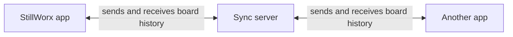
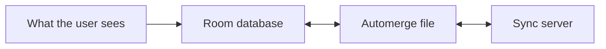
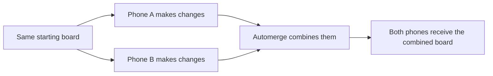
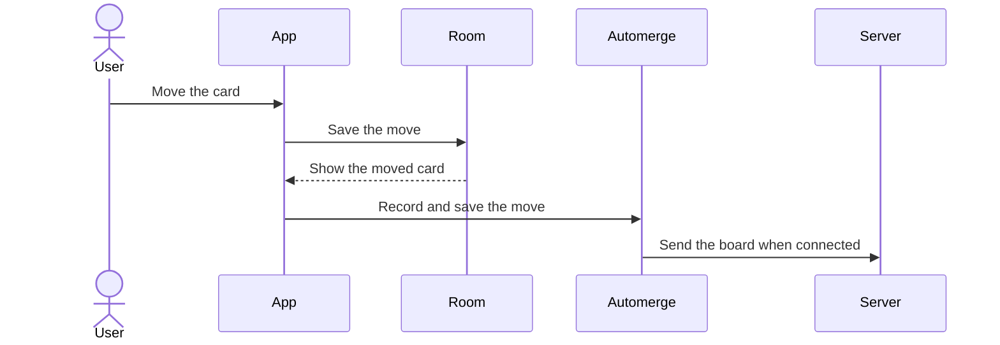
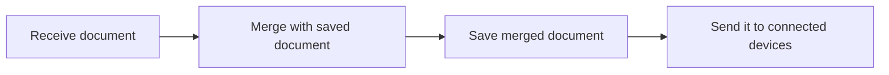
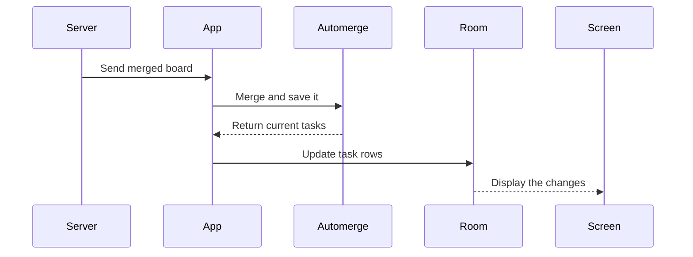

# StillWorx architecture explained from scratch

## 1. What StillWorx is

StillWorx is a shared Kanban board with three columns:

- TODO
- DOING
- DONE

You can create cards, rename them, move them between columns, and delete them.

The important feature is that the app still works without an internet connection. Changes are saved on the phone first. When the internet becomes available, the phone shares those changes with the server and other phones.

This is called an **offline-first** design.

## 2. The whole system in one picture



The server helps devices exchange changes. It does not control the user interface or provide normal task APIs.

## 3. The two kinds of storage on the phone

StillWorx stores the board twice on each phone. This sounds wasteful, but each copy has a different job.



### Room database

Room stores ordinary task rows. It is designed for the Android app to read and display quickly.

Example:

```text
Task
  id: "task-123"
  title: "Write article"
  column: "DOING"
  updatedAt: 1786900000000
  isDeleted: false
  syncPending: false
```

The screen always reads tasks from Room. It never reads tasks directly from the server or Automerge.

### Automerge file

Automerge stores the board together with its change history. That history is what allows two phones to edit the board separately and later combine their work.

The file is stored inside the app's private storage:

```text
filesDir/crdt/<boardId>.automerge
```

The app normally has one Automerge file for the configured board.

### Why both are needed

| Room | Automerge |
|---|---|
| Makes the Android app simple and fast | Makes synchronization possible |
| Feeds the UI | Remembers change history |
| Stores easy-to-query task rows | Merges work from different devices |
| Is the source of what the screen displays | Is the source of replicated history |

An easy way to remember this is:

> Room is for using the app. Automerge is for sharing changes.

## 4. What a CRDT is

CRDT stands for **conflict-free replicated data type**.

That long name describes a data structure that can be copied to several devices, changed separately, and merged later.

Imagine two phones start with the same board:

```text
Phone A: Write article is in TODO
Phone B: Write article is in TODO
```

The phones go offline. A user changes a title on phone A. Another user moves a different card on phone B. When the phones reconnect, both changes can be kept.



The devices do not have to stay online and do not have to make changes in the same order.

## 5. What Automerge does

Automerge is the CRDT library used by StillWorx.

It performs four important jobs:

1. It records a local change in the board's history.
2. It saves the board and its history as binary data.
3. It loads saved or received binary data.
4. It merges histories from different devices.

The Automerge file is not just a list of the current tasks. It also contains information about how the board changed. That is why the app must keep the file instead of recreating it from scratch every time.

## 6. What happens when you change a card

Suppose you move a card from TODO to DOING.



The important order is:

1. The app saves the move in Room.
2. The screen updates immediately.
3. The synchronization code copies the changed task into Automerge.
4. The Automerge file is saved on the phone.
5. If connected, the complete Automerge document is sent to the server.
6. If offline, the saved document waits for the next connection.

The card move never waits for the server.

## 7. What `syncPending` means

When a task is first changed in Room, it gets:

```text
syncPending = true
```

This means:

> This version of the Room task has not yet been safely stored in the local Automerge file.

After the task has been copied into Automerge and the Automerge file has been saved, the app changes it to:

```text
syncPending = false
```

It does **not** mean that the server or another phone has received the change. It only describes the step between Room and the local Automerge file.

## 8. What the server stores

The server stores one Automerge file for each board:

```text
data/<boardId>.automerge
```

For example:

```text
data/demo-board.automerge
data/family-board.automerge
data/work-board.automerge
```

The server does not store a task table. It does not know that a field called `column` means TODO, DOING, or DONE. It treats the document as Automerge data belonging to a board ID.

## 9. What the server does with a message



In more detail:

1. A phone sends a board ID and an Automerge document.
2. The server checks that the message is valid.
3. The server loads the saved document for that board.
4. Automerge combines the received and saved histories.
5. The server saves the result.
6. Only after saving, it broadcasts the result to devices subscribed to that board.

The sending phone also receives the broadcast. This helps it learn about changes the server already had.

## 10. What happens when a remote change arrives



The screen does not have a special network update path. A remote change is written into Room, and the normal Room observation updates the screen.

This keeps the user interface simple. It reacts to one source: Room.

## 11. What happens after being offline

The app automatically tries to reconnect three times. The current prototype waits two seconds between attempts. If those attempts fail, the user can press **Retry**.

After the app reconnects, it does not immediately rearrange the visible board with remote changes. Instead:

1. the app receives and temporarily stages remote documents;
2. the visible Room board stays unchanged;
3. the user sees **Sync changes**;
4. the user approves synchronization;
5. the app merges all staged documents into Automerge;
6. the app saves the result; and
7. the app updates Room once.

This approval step is a user-experience choice. Automerge itself does not require it.

The staged remote documents are held in memory. If the app process stops before approval, the app will need to receive current server state again later.

## 12. What happens when two users change the same field

Suppose two offline users move the same task:

```text
Phone A: TODO -> DOING
Phone B: TODO -> DONE
```

These are concurrent changes. Neither phone knew about the other move when it made its own move.

Automerge remembers both changes and chooses a deterministic value when the document is read. Every replica eventually makes the same choice, so the phones converge.

However, Automerge does not know which column is better for the business. StillWorx logs that multiple values existed, but the current prototype does not ask the user to resolve the conflict.

This is an important distinction:

> CRDT convergence means all replicas agree. It does not guarantee that the agreed result matches human intent.

## 13. How deletion works

StillWorx does not immediately erase a deleted task from all stored data. It marks the task as deleted:

```text
isDeleted = true
```

This marker is called a **tombstone**.

Room hides tombstones from the screen, so the card disappears immediately. Automerge keeps the deletion in its history, so an old offline phone cannot accidentally bring the card back just by reconnecting.

The prototype does not yet remove old tombstones or compact history.

## 14. How messages travel

The app and server use a WebSocket. A WebSocket is a long-lived connection that allows either side to send a message.

A simplified sync message looks like:

```json
{
  "type": "sync",
  "boardId": "demo-board",
  "document": "<Base64 Automerge data>"
}
```

The Automerge binary data is converted to Base64 text so it can be placed inside JSON.

The prototype sends the complete document every time. This is easy to understand and implement, but documents become larger as history grows. A production system should normally use Automerge's incremental sync protocol to send only missing changes.

## 15. What survives a restart

### On the phone

- Room task rows survive.
- The local Automerge file survives.
- The open WebSocket does not survive.
- Retry timers do not survive.
- Unapproved documents held only in memory do not survive.
- A drag in progress does not survive.

### On the server

- Saved board `.automerge` files survive.
- Open connections do not survive.
- Board subscriptions do not survive.
- In-memory document cache does not survive.
- Processing queues do not survive.

After restarting, the server reloads a board file the first time that board is used.

## 16. What “source of truth” means here

There is not one answer for every question.

| Question | Answer |
|---|---|
| What should the phone display? | Room |
| What local history can be synchronized? | The phone's Automerge file |
| What merged history survives a server restart? | The server's Automerge file |
| Can an offline phone have newer valid work than the server? | Yes |

The server is therefore not the only owner of valid data. Every offline client can temporarily hold history that no other replica has seen.

## 17. Current prototype limitations

- Complete documents are sent instead of only missing changes.
- There is no login or board permission system.
- The server should not be exposed directly to the public internet.
- A connected WebSocket does not prove that every task change reached the server.
- Room and the local Automerge file cannot be changed in one shared transaction.
- Conflict alternatives are logged but not shown to users.
- Tombstones and Automerge history are not compacted.
- Reliable background sync needs additional Android lifecycle handling.
- Production reconnects should use exponential backoff and random jitter.

## 18. The shortest useful summary

```text
Local change
  -> save in Room
  -> show it immediately
  -> record it in Automerge
  -> save the local Automerge file
  -> send it when connected
  -> server merges and saves it
  -> other phones merge it
  -> other phones update their Room databases
```

Remember these three statements:

1. **Room is for the screen.**
2. **Automerge is for merging history.**
3. **The server helps replicas meet.**

